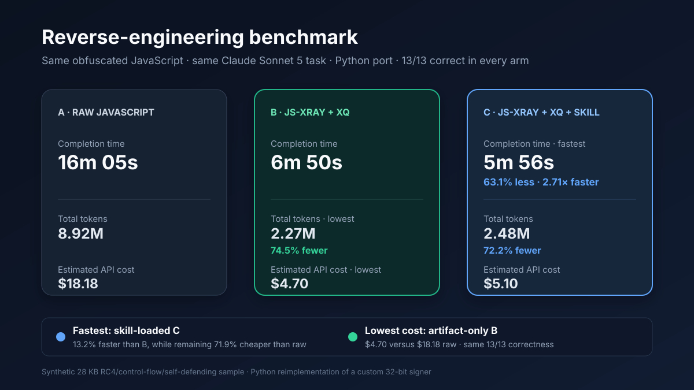

# js-xray

[English](README.md) | **한국어**

난독화되거나 압축된 JavaScript를 에이전트가 빠르게 이해하고 다른 언어로 포팅할 수 있도록 정리하는 정적 분석 도구입니다.

WebCrack과 Babel AST 패스를 조합해 문자열 배열, 제어 흐름 평탄화, 호출 래퍼를 정리한 뒤 함수 역할, 호출 흐름, 네트워크 계약, 알고리즘 단서와 포팅 사양을 추출합니다. 에이전트는 큰 파일을 반복해서 읽는 대신 `xq`로 필요한 함수나 흐름만 조회할 수 있습니다.

## 무엇이 좋아지는가

동일한 난독화 파일을 Claude Sonnet 5로 Python에 포팅한 실험에서 다음 결과를 얻었습니다.

### 무엇을 분석했는가

- **입력 파일:** 28 KB JavaScript를 한 줄로 압축하고 RC4 문자열 배열, 제어 흐름 평탄화, self-defending 코드를 적용한 합성 강난독화 샘플입니다.
- **숨겨진 동작:** 표준 해시가 아닌 자체 `sign(input, salt)` 함수입니다. 32비트 상태 변수 두 개, UTF-16 `charCodeAt` 입력, salt 혼합, XOR·비트 시프트, `Math.imul`과 일반 JavaScript 곱셈을 조합해 8자리 소문자 16진수 서명을 반환합니다.
- **에이전트 과제:** 이 연산을 처음부터 리버스 엔지니어링하고 상태·루프 구조를 설명한 뒤, 실행 시 원본 JavaScript를 호출하지 않는 동일 동작의 Python `sign(input, salt)`와 `digest(input)`를 구현하는 것이었습니다.
- **정확성 판정:** 빈 문자열, ASCII, 한글, 이모지, 서로게이트 경계, U+10FFFF, 200자 입력을 포함한 13개 사례에서 원본 JavaScript와 Python 출력이 같은지 검사했습니다. 두 조건 모두 13/13을 통과했습니다.

서로 다른 모델이나 프롬프트를 비교한 것이 아니라 **조사 방법만 비교**했습니다.

- **A — 원본만:** 난독화 파일만 제공. `xq`와 스킬 없음.
- **B — 산출물 + xq:** 같은 원본에 미리 생성한 `.xrayjs` 산출물을 제공하고 `xq` 사용 허용.
- **C — 산출물 + xq + 스킬:** B와 같은 조건에 js-xray Codex 스킬까지 로드. 실제 권장 설치 환경과 가장 가까운 조건.

| 지표 | A — 원본만 | B — js-xray + xq | C — js-xray + xq + 스킬 | A 대비 핵심 결과 |
| --- | ---: | ---: | ---: | ---: |
| 정확도 | 13/13 | 13/13 | 13/13 | 정확도 손실 없음 |
| 소요 시간 | 16분 5초 | 6분 50초 | **5분 56초** | **C: 63.1% 단축, 2.71배 빠름** |
| 총 토큰 | 8,920,677 | **2,273,771** | 2,478,064 | **B: 74.5% 절감, 3.92배 효율** |
| API 비용 | $18.18 | **$4.70** | $5.10 | **B: 74.2% 저렴, C: 71.9% 저렴** |
| 도구 호출 | 89회 | **44회** | **44회** | **50.6% 감소** |
| 턴당 피크 컨텍스트 | 162,008 | **74,273** | 83,160 | **B: 54.2% 감소** |
| 포팅 구현 시작 | call #76 | **call #9** | call #12 | **B: 8.44배 일찍, C: 6.33배 일찍** |

**결론:** 스킬까지 로드한 C가 완성 속도는 가장 빨랐습니다. **16분 5초 → 5분 56초**로 줄이면서 총 토큰은 **72.2%**, 추정 API 비용은 **71.9%** 절감했습니다. B는 가장 적은 토큰과 가장 낮은 비용을 기록했습니다. C는 B보다 토큰이 약 **9.0%**, 비용이 **8.7%** 더 들었지만 작업은 **13.2% 더 빨리** 끝났습니다.



비용은 벤치마크 당시 사용한 Claude Sonnet 5 요금인 입력 $2/MTok, 출력 $10/MTok을 적용했습니다. 자세한 실험 조건과 토큰 산정 방식은 [BENCHMARK.md](BENCHMARK.md)에 있습니다. 파이프라인과 결과 비교를 한 장에 정리한 편집 가능한 다이어그램은 [BENCHMARK.drawio](BENCHMARK.drawio)입니다.

> 이 결과는 한 번의 통제된 실험입니다. 파일 난이도, 모델, 캐시 및 도구 호출 환경에 따라 절대 수치는 달라질 수 있습니다.

## 요구 사항

- Python 3
- Bun

WebCrack의 `isolated-vm` 네이티브 바이너리 때문에 Node `>=22 <23` 또는 `>=24 <25`가 필요합니다. 권장 설치기는 호환 Node가 있으면 재사용하고, fnm/Volta가 있으면 Node 24를 설치하며, 둘 다 없으면 SHA-256을 검증한 휴대용 Node 24를 내려받습니다. 사용자가 Node를 따로 설정할 필요는 없습니다.

휴대용 런타임 자동 설치는 macOS와 Linux의 arm64/x64를 지원합니다. 다른 환경에서는 `JSXRAY_NODE`로 호환 Node 경로를 지정하면 나머지 설치를 그대로 사용할 수 있습니다.

## 설치

### 원클릭 설치(권장)

```bash
bun create h053698/js-xray "$HOME/.local/share/js-xray" --no-install --no-git && bun run --cwd "$HOME/.local/share/js-xray" setup
```

이 한 줄을 그대로 붙여넣으면 저장소 다운로드, 고정된 의존성 설치, 호환 Node 24 준비, `js-xray`·`xq` 명령 등록, Codex 스킬 등록까지 처리합니다. `--no-install`은 WebCrack의 네이티브 의존성을 설치하기 전에 js-xray가 먼저 Node 24를 준비하도록 하기 위한 안전장치입니다.

### 코딩 에이전트에게 줄 짧은 설치 프롬프트

아래 문장을 Codex, Claude Code 같은 로컬 코딩 에이전트에 그대로 전달하세요.

```text
https://github.com/h053698/js-xray 저장소의 README에 있는 Bun 원클릭 설치 방법으로 js-xray를 설치해줘. 기존의 관련 없는 명령이나 스킬은 덮어쓰지 말고, 설치 후 js-xray --help와 xq --help가 동작하는지, Codex js-xray 스킬이 등록됐는지 확인해줘. ~/.local/bin이 PATH에 없다면 셸 설정을 자동 수정하지 말고 내가 추가할 정확한 명령만 알려줘.
```

설치가 끝나면 Codex를 다시 시작하고 다음처럼 실행합니다.

```bash
js-xray path/to/target.js
xq path/to/target.xrayjs summary
```

`~/.local/bin`이 PATH에 없다면 설치기가 셸 설정에 추가할 정확한 명령을 출력합니다.

이미 저장소를 받은 상태라면 다시 다운로드하지 않고 다음 한 줄만 실행하면 됩니다.

```bash
bun run setup
```

실제 변경 없이 설치 내용을 미리 확인할 수도 있습니다.

```bash
bun run setup --dry-run
```

### 수동 설치

#### 1. 저장소와 의존성

```bash
git clone https://github.com/h053698/js-xray.git
cd js-xray

fnm install 24
bun install
```

fnm 대신 Volta나 nvm을 사용해도 됩니다.

```bash
volta install node@24
# 또는
nvm install 24
```

npm을 사용하려면 `npm install`을 실행해도 됩니다. TOON 참조 구현을 사용하는 전체 테스트까지 실행하려면 devDependency도 설치되어 있어야 합니다.

#### 2. xq 명령 설치

```bash
sh scripts/install-xq.sh --dry-run
sh scripts/install-xq.sh
```

설치 스크립트는 저장소의 `skill/scripts/xq.py`를 사용자 전용 PATH 디렉터리에 심링크합니다. 일반적으로 `~/.local/bin/xq`를 사용하며 다음 성질을 가집니다.

- sudo와 시스템 디렉터리를 사용하지 않음
- 여러 번 실행해도 안전함
- 다른 프로그램의 `xq`를 덮어쓰지 않음
- 저장소에서 `git pull`하면 설치된 명령도 바로 갱신됨

PATH에 등록하지 않으려면 아래처럼 직접 실행할 수 있습니다.

```bash
python3 skill/scripts/xq.py summary
```

#### 3. Codex 스킬 등록

Codex가 `$js-xray` 스킬로 자동 인식하게 하려면 저장소의 `skill/` 디렉터리를 Codex 스킬 경로에 연결합니다.

```bash
mkdir -p ~/.codex/skills
ln -s "$(pwd)/skill" ~/.codex/skills/js-xray
```

이미 같은 이름이 있다면 먼저 링크 대상을 확인하고 직접 교체 여부를 결정하세요. 복사도 가능하지만 심링크를 쓰면 저장소 업데이트가 즉시 반영됩니다.

등록 후 Codex 앱을 새로 열거나 스킬 목록을 새로고침한 다음 다음처럼 사용할 수 있습니다.

```text
$js-xray path/to/target.js
```

스킬을 쓰지 않아도 CLI 전체 기능은 사용할 수 있습니다.

#### 4. 토큰 통계 정확도 높이기(선택)

```bash
pip install tiktoken
```

`tiktoken`이 없으면 TOON 절감률을 문자 수 기반으로 계산합니다. 분석 자체에는 영향을 주지 않습니다.

## 빠른 시작

```bash
js-xray path/to/target.js
```

기본적으로 입력 파일 옆에 `target.xrayjs/`가 생성됩니다.

명령 설치를 하지 않았다면 `python3 skill/scripts/xray.py path/to/target.js`를 사용하면 됩니다.

```bash
xq path/to/target.xrayjs summary
xq path/to/target.xrayjs entries
xq path/to/target.xrayjs find sign
xq path/to/target.xrayjs show signData
xq path/to/target.xrayjs port --all
```

현재 디렉터리에 분석 폴더가 하나뿐이면 경로를 생략할 수 있습니다.

```bash
cd path/to
xq summary
xq show signData
```

## 분석 순서

```text
input.js
  │
  ├─ 1. WebCrack deobfuscate
  │      RC4/base64 문자열 배열과 알려진 난독화 패턴 정리
  │
  ├─ 2. residual string inline
  │      스코프별 문자열 배열과 디코더를 Babel AST로 인라인
  │
  ├─ 3. deflatten + wrapper inline
  │      dead branch 제거, switch dispatcher 선형화,
  │      OBJ.forward(fetch, url) → fetch(url) 변환
  │
  ├─ 4. structure
  │      함수, 클래스, 호출 간선, URL 등 사실 추출
  │
  ├─ 5. explain
  │      진입점, 역할, 실행 흐름, 알고리즘 단서, 포팅 사양 생성
  │
  ├─ 6. anchor scan
  │      crypto, network, fingerprinting, storage 등 키워드 근거 수집
  │
  ├─ 7. report
  │      사람이 읽을 수 있는 Markdown 보고서 생성
  │
  └─ 8. TOON
         같은 분석 데이터를 토큰 효율적인 형식으로 인코딩
```

각 소스 변환 단계는 결과가 다시 파싱되고 `node --check`를 통과하는지 확인합니다. deflatten은 의미 보존을 정적으로 증명하지 못하는 구조를 그대로 남기며, 실패하면 입력으로 롤백합니다.

## 산출물

```text
target.xrayjs/
├── pipeline.json       단계별 명령, 성공 여부, 시간과 메타데이터
├── webcrack.js         WebCrack 출력
├── webcrack.json       WebCrack 변환 통계
├── webcrack.log        WebCrack 로그
├── inline.js           잔여 문자열 인라인 후 소스
├── inline.json         문자열 인라인 통계
├── clean.js            최종 정리된 소스
├── deflatten.json      dead branch/switch/wrapper 변환 통계
├── structure.json      전체 AST 사실과 호출 그래프
├── xray.json           정규 분석 데이터
├── xray.toon           토큰 절약형 분석 데이터
├── toon_stats.json     JSON 대비 TOON 크기 및 토큰 통계
├── analysis.json       키워드 앵커 결과
└── report.md           사람이 읽는 보고서
```

`xray.json`은 정규 스키마와 호환성을 위한 기준 데이터이고, `xray.toon`은 에이전트가 적은 토큰으로 다시 읽기 위한 파생 표현입니다. `xq`는 둘 중 존재하는 산출물을 읽어 동일한 질의 결과를 반환합니다.

## xq 명령

전체 분석 파일을 컨텍스트에 넣기 전에 `xq`로 범위를 좁히는 것이 권장 사용법입니다.

| 명령 | 용도 |
| --- | --- |
| `xq summary` | 파일 규모, 진입점, 흐름, 알고리즘 개요 |
| `xq entries` | 외부에서 시작되는 진입점 목록 |
| `xq find <pattern>` | 함수 이름과 분석 데이터에서 심볼 검색 |
| `xq show <name-or-id>` | 함수 분석과 `clean.js` 소스 조각 표시 |
| `xq callers <name>` | 호출자 추적 |
| `xq callees <name>` | 피호출자 추적 |
| `xq flow [symbol]` | 전체 흐름 또는 심볼 관련 흐름 |
| `xq roles [role]` | 역할별 함수 조회 |
| `xq port [algorithm|--all]` | 다른 언어 구현에 필요한 포팅 사양 |
| `xq grep <pattern>` | `clean.js` 검색과 함수 귀속 |

권장 조사 순서는 다음과 같습니다.

1. `xq summary`로 전체 성격을 확인합니다.
2. `xq entries`, `xq flow`로 외부 입력부터 실행 경로를 좁힙니다.
3. `xq find`, `xq roles`로 관심 함수를 찾습니다.
4. `xq show`, `xq callers`, `xq callees`로 해당 부분만 읽습니다.
5. 다른 언어로 옮길 때만 `xq port --all`과 필요한 `clean.js` 조각을 확인합니다.
6. 원본 전체 읽기는 정적 결과가 부족하거나 동적 동작을 검증해야 할 때만 수행합니다.

## 주요 옵션

```bash
python3 skill/scripts/xray.py input.js \
  --top 50 \
  -o output.xrayjs
```

| 옵션 | 설명 |
| --- | --- |
| `-o, --outdir PATH` | 출력 디렉터리 지정 |
| `--top N` | `xray.json`에서 상세 설명할 함수 수 |
| `--anchors FILE` | 사용자 정의 앵커 파일 |
| `--skip-deobfuscate` | WebCrack 단계 생략 |
| `--skip-inline` | 잔여 문자열 인라인 생략 |
| `--skip-deflatten` | 제어 흐름 평탄화 해소 생략 |
| `--skip-anchors` | 키워드 앵커 스캔 생략 |
| `--mangle` | WebCrack mangle 활성화 |

## 안전성과 한계

- 정적 분석 결과입니다. 런타임 생성 코드, 네트워크 응답, 브라우저 상태에 의존한 동작은 별도 검증이 필요합니다.
- JSVMP 형태는 탐지하고 경고하지만 사용자 정의 바이트코드를 완전 복구하지 않습니다.
- 단일 상수만 일치하면 표준 해시로 단정하지 않고 단서로만 기록합니다.
- `charCodeAt` 기반 알고리즘을 포팅할 때는 JavaScript UTF-16 코드 유닛 의미를 보존합니다.
- deflatten과 wrapper 인라인은 안전성을 증명할 수 없는 형태를 거부합니다.
- 분석 대상 코드를 실행하지 않는 정적 파이프라인이지만 WebCrack 및 Node 의존성은 신뢰 가능한 버전으로 관리해야 합니다.

## 테스트

```bash
python3 tests/test_xray.py
python3 skill/tests/test_toon_encoder.py
```

테스트는 문자열 인라인, 실행 동등성 기반 deflatten 검증, 거부해야 하는 모호한 구조, 호출 래퍼, xq/TOON 동등성, 설치 스크립트와 전체 파이프라인을 포함합니다.

## 개발 구조

| 경로 | 역할 |
| --- | --- |
| `skill/SKILL.md` | Codex 스킬 지침과 에이전트 조사 절차 |
| `skill/scripts/xray.py` | 파이프라인 오케스트레이터 |
| `skill/scripts/xq.py` | 분석 산출물 질의 CLI |
| `skill/scripts/run_webcrack.py` | WebCrack 래퍼 |
| `skill/scripts/inline_strings.py/.mjs` | 스코프 안전 문자열 인라인 |
| `skill/scripts/deflatten.py/.mjs` | 제어 흐름과 호출 래퍼 정리 |
| `skill/scripts/structure.py/.mjs` | AST 사실 추출 |
| `skill/scripts/explain.py` | 역할, 흐름, 포팅 사양 생성 |
| `skill/scripts/toon_encoder.py` | JSON 모델을 TOON으로 인코딩/디코딩 |
| `scripts/install-xq.sh` | 사용자 PATH에 xq 설치 |
| `fixtures/` | 회귀 테스트용 난독화 패턴 |
| `tests/` | 메인 통합 테스트 |
| `BENCHMARK.md` | 벤치마크 상세 자료 |
| `BENCHMARK.drawio` | 편집 가능한 파이프라인 다이어그램 |
